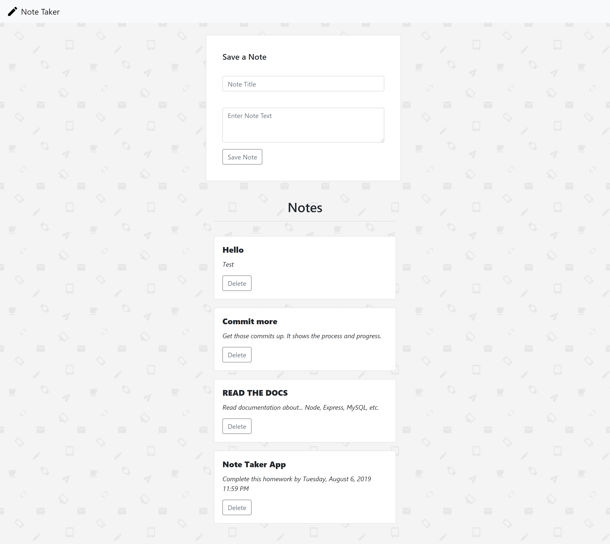

# Note Taker

Note Taker is an application that allows the user to read, create/save, and delete notes from a MySQL database. The application was deployed to heroku. 

https://notes-taker-app.herokuapp.com/

## Technologies Used

Built with Node, Express, and MySQL.

Express is used to handle the routing and server HTML as well as JSON. The MySQL database is used to store notes so that the user is able to access the same notes shown whenever they visit the website.

## Features

As mentioned earlier, the Note Taker application allows the user to read, save, and delete notes from a MySQL database. The get, post, and delete methods were used to implement these API routes.

